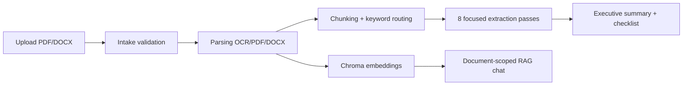

# Spec Check — Tender Document Intelligence

Adaptation of the **RFQ/RFP summarization** stack for **tender specification review**: upload tender documents (PDF/DOCX), parse them into structured text, run focused LLM extractions with citations, produce an executive summary, and chat over the document via **Chroma + OpenAI embeddings** (document-scoped RAG).

The codebase is intentionally shared with the RFQ project so you can reuse the same pipeline (intake → parse → chunk → extract → summarize → RAG chat) and refine prompts, extraction types, and UI copy for **spec-check** workflows.

---

## Architecture (current)



| Layer | Stack | Notes |
|--------|--------|--------|
| API | Django 5 + DRF | `backend/` |
| UI | Next.js 15 + React 19 + Tailwind | `frontend/` |
| DB | PostgreSQL | Document metadata, jobs, summaries |
| Queue (optional) | Celery + Redis | **Not required in dev** — see sync flags below |
| Vectors | ChromaDB | Per-document chunks for chat |
| LLM | OpenAI (`gpt-4o`, `text-embedding-3-small`) | Extraction, summary, chat |

### Processing pipeline

1. **Documents** — upload, store under `backend/media/`, processing jobs with stage logs.
2. **Parsing** — PyMuPDF / pdfplumber, DOCX via `python-docx`, OCR fallback (Tesseract) for scanned PDFs.
3. **Intelligence** — 8 parallel extraction types (eligibility, deadlines, technical requirements, scope, payment, penalties, mandatory docs, evaluation), then synthesized summary with **source citations**.
4. **Chat** — embed parsed chunks into Chroma; retrieve top-K for Q&A grounded in the tender.

### New project vs RFQ copy — what to change

| Area | Action | Status |
|------|--------|--------|
| **PostgreSQL** | New DB e.g. `spec_check_rag` in `DATABASE_URL` | You did this |
| **Migrations** | `python manage.py migrate` on empty DB | Done |
| **Chroma** | `CHROMA_COLLECTION_NAME=spec_check_document_chunks`; delete `backend/chroma_data/` if copied from RFQ | Config updated |
| **Media** | Use fresh `backend/media/` (do not copy RFQ uploads) | Per-project folder |
| **Redis** (optional) | Use DB `2`/`3` in broker URLs if RFQ also uses `0`/`1` | Optional |
| **CORS / ports** | Frontend `3010`, backend `8004`, CORS includes `3010` | Updated |
| **Branding** | UI titles, health `service` name, package name | Updated |
| **LLM prompts** | `intelligence/prompts/templates.py` — extraction types & summary JSON | **Next phase** (still RFQ-oriented logic) |
| **Extraction types** | `intelligence/choices.py` `FOCUSED_EXTRACTION_TYPES` | **Next phase** |

## Spec-check refinement (planned)

Prompts and extraction types still use **RFQ procurement** structure internally (`backend/apps/intelligence/prompts/`). Same pipeline; refine for spec check:

- Redefine `FOCUSED_EXTRACTION_TYPES` (e.g. materials, dimensions, standards, tolerances, deliverables, compliance clauses).
- Update `EXTRACTION_TYPE_INSTRUCTIONS` and summary system prompts for **spec compliance** rather than bid/no-bid.
- Adjust frontend branding (`AppShell`, page titles) from “RFQ” to “Spec Check”.
- Add validation rules (required fields checklist vs. tender form).

---

## Prerequisites

| Tool | Purpose |
|------|---------|
| Python 3.11+ | Backend |
| Node.js 18+ | Frontend |
| PostgreSQL 14+ | Primary database |
| Redis 6+ | Celery broker (health check; optional if sync mode) |
| Tesseract OCR | Scanned PDF fallback (`PARSING_OCR_ENABLED`) |
| OpenAI API key | Extraction, summary, embeddings, chat |
| LibreOffice or MS Word (Windows) | DOCX → PDF preview (optional) |

---

## Quick start (local dev)

### 1. Database

Create a PostgreSQL database (name must match `DATABASE_URL` in `backend/.env`):

```sql
CREATE DATABASE spec_check_rag;
-- Must match DATABASE_URL in backend/.env
```

URL-encode special characters in passwords (`#` → `%23`, etc.).

### 2. Backend

```powershell
cd backend
python -m venv venv
.\venv\Scripts\Activate.ps1
pip install -r requirements.txt
copy .env.example .env
# Edit .env: DATABASE_URL, OPENAI_API_KEY
python manage.py migrate
python manage.py runserver
```

API: [http://localhost:8000](http://localhost:8000)  
Health: [http://localhost:8000/api/health/](http://localhost:8000/api/health/)

**Dev without Celery workers** (recommended on Windows) — in `backend/.env`:

```env
INTELLIGENCE_SYNC_GENERATION=True
PROCESSING_SYNC=True
```

Parsing and summary generation run in-process; Redis is still used for health checks if running.

### 3. Frontend

```powershell
cd frontend
copy .env.example .env.local
npm install
npm run dev
```

App: [http://localhost:3010](http://localhost:3010) (fixed port — avoids clashes with other Next apps on 3000–3003)

Ensure `NEXT_PUBLIC_API_BASE_URL=http://localhost:8004/api/v1` in `frontend/.env.local` (or `8000` if nothing else uses it).

**ChunkLoadError on wrong port?** If you see `Loading chunk app/layout failed` on `:3003`, you are hitting a **dead or stale** dev server. Use **only** `http://localhost:3010` after `npm run dev` in this project.

### 4. Verify

- Backend health returns `"status": "healthy"` (database + media; worker `ok` in sync mode).
- Frontend loads dashboard; upload a PDF/DOCX and confirm processing → summary → chat.

---

## Environment reference

| File | Purpose |
|------|---------|
| `backend/.env` | Django, DB, OpenAI, Celery, Chroma (not committed) |
| `backend/.env.example` | Template with all keys |
| `frontend/.env.local` | API base URL (not committed) |
| `frontend/.env.example` | Template |

Key backend toggles:

| Variable | Default (dev) | Meaning |
|----------|----------------|---------|
| `PROCESSING_SYNC` | `True` | Parse in background thread, no Celery |
| `INTELLIGENCE_SYNC_GENERATION` | `True` | Summary in HTTP request |
| `CHROMA_PERSIST_DIR` | `./chroma_data` | Vector store on disk |
| `INTELLIGENCE_EXTRACTION_WORKERS` | `8` | Parallel extraction threads |

---

## Project layout

```
Spec_check_RAG_Approach/
├── backend/
│   ├── apps/
│   │   ├── documents/      # Upload, storage, metadata
│   │   ├── processing/     # Pipeline jobs & stages
│   │   ├── parsing/        # PDF/DOCX/OCR
│   │   ├── intelligence/   # Extraction, summary, citations
│   │   ├── chat/           # Chroma RAG Q&A
│   │   └── health/         # Health checks
│   ├── config/             # Django settings & URLs
│   ├── manage.py
│   └── requirements.txt
└── frontend/
    └── src/
        ├── app/              # Next.js routes
        ├── components/       # Upload, summary, chat, PDF preview
        └── lib/api/            # API client helpers
```

---

## API overview

| Prefix | App |
|--------|-----|
| `/api/v1/` | Documents, processing, parsing, intelligence, chat |
| `/api/health/` | Liveness / dependency checks |
| `/admin/` | Django admin |

---

## Optional: Celery worker (production-style)

When `PROCESSING_SYNC=False` or `INTELLIGENCE_SYNC_GENERATION=False`:

```powershell
cd backend
.\venv\Scripts\Activate.ps1
celery -A config worker -l info -P solo
```

On Windows use `-P solo`. Redis must be running.

---

## Troubleshooting

| Issue | Check |
|-------|--------|
| Health `database` error | PostgreSQL running; `DATABASE_URL` correct; DB exists |
| Health `redis` error | Start Redis or ignore if only using sync mode (may still show degraded) |
| OCR fails | Tesseract on `PATH`; set `PARSING_OCR_ENABLED=False` for text-only PDFs |
| Summary stuck | `INTELLIGENCE_SYNC_GENERATION=True`; valid `OPENAI_API_KEY` |
| CORS errors | Frontend origin in `CORS_ALLOWED_ORIGINS` / `development.py` |
| Chat empty context | Parsing completed; Chroma indexed after parse (re-open document chat) |

---

## License / origin

Copied from the RFQ summarization project; rebrand and domain prompts for **tender spec check** as the product evolves.
